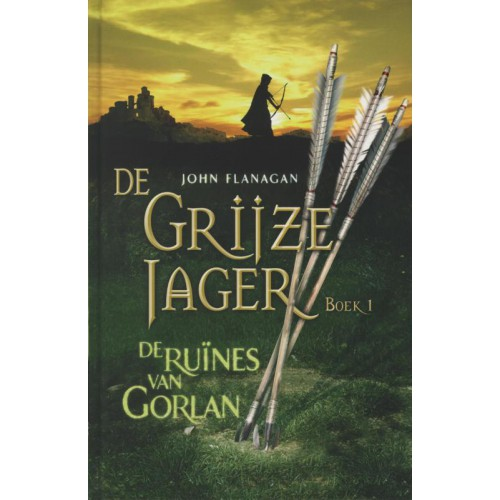

# De Grijze Jager: De ruïnes van Gorlan

----

----

# Inleiding

* Boek 1 van een serie van 12 delen
* Schrijver: John Flanagan uit Australië
* Jaar van uitgave: 2004 (Australië) 2007 (Nederland)
* Uitgever: Gottmer Haarlem
* Oorspronkelijke titel: Ranger's Apprentice: The Ruins of Gorlan

----

# Plaats en tijd

* De plaats is verzonnen, bijvoorbeeld de Bergen van Nacht en Ontij
* Het speelt zich af in de Middeleeuwen met ridders en kastelen

----

# Hoofdpersonen

* Will
* Arnaut
* Halt

* Will lijkt op Michael, de zoon van John Flanagan

----

# Samenvatting

Will is een rekruut van het weeshuis van het kasteel Redmont. Hij wil graag worden uitgekozen als leerling bij de Krijgsschool. Maar hij wordt uitgekozen om leerling te worden bij Halt, de mysterieuze, Grijze Jager. Hij is erg teleurgesteld als hij dat hoort. Maar later leert hij dat het zo gek nog niet is bij Halt. Dan gaat hij de strijd aan tegen de Kalkara, 2 enge monsters die bij Morgarath horen. De strijd is bij de ruïnes van Gorlan.

----

# Voorlezen

pagina 179 - 181

----

# Waarom ik dit boek heb gekozen

Het is een spannend boek, omdat de schrijver steeds allemaal tussenvoegels doet tussen de spannende dingen. Dan word je daardoor heel nieuwsgierig. Ook vind ik het leuk, dat het boek zich afspeelt in de Middeleeuwen.

-----

# Leuke dingen

* Website: [www.degrijzejager.nl](http://www.degrijzejager.nl/)
* Facebook: [facebook.com/deGrijzeJager](https://www.facebook.com/deGrijzeJager/)
* Grijze Jager dag: 15 mei 2016 in Archeon
* Nieuw deel: 25 februari 2016

----

# Quiz

* In welke tijd speelt dit boek zich af? <!-- .element: class="fragment visible" data-fragment-index="1" -->
* De Middeleeuwen <!-- .element: class="fragment visible" data-fragment-index="2" -->
* Waarom heeft de schrijver dit boek geschreven? <!-- .element: class="fragment visible" data-fragment-index="3" -->
* Omdat Michael de zoon van John Flanagan niet veel meer las. <!-- .element: class="fragment visible" data-fragment-index="4" -->

----

# Vragen?

----

# Einde
